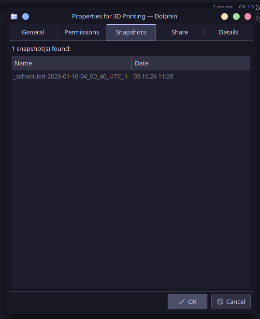

# KDE Dolphin Snapshots Pane

This plugin adds a pane with snapshot information to Dolphin's properties dialog.



It currently checks for snapshots in the following directories:
- `.snap`
- `.snapshot`
- `.snapshots`
- `.zfs/snapshot`

## Usage

To use the Snapshots Pane in Dolphin, right-click on a file or folder and select "Properties".
In the properties dialog, navigate to the "Snapshots" tab to view snapshots of the selected file or folder.
You can open a snapshot by double-clicking on it in the list.

## Content Note

While the bulk of the implementation of this project has been done entirely by hand,
some commits used generative large language models to implement features or bug fixes.

I use this project as a personal testing ground for tools such as GitHub Copilot and Anthropic's Claude.
Any commit containing code by a large language model has its author set accordingly.

Additionally, this repository is also used to test other software engineering tools, such as Jujutsu as version control system.

## Building

```bash
git clone https://github.com/vincentscode/kde-dolphin-snapshots-pane.git
cd kde-dolphin-snapshots-pane

# configure
cmake -B build -DCMAKE_BUILD_TYPE=Release

# build
cmake --build build -j$(nproc)

# install (optional)
sudo cmake --build build --target install
```

## Testing

```bash
# must already be configured and built

# run tests
cmake --build build --target test
```
